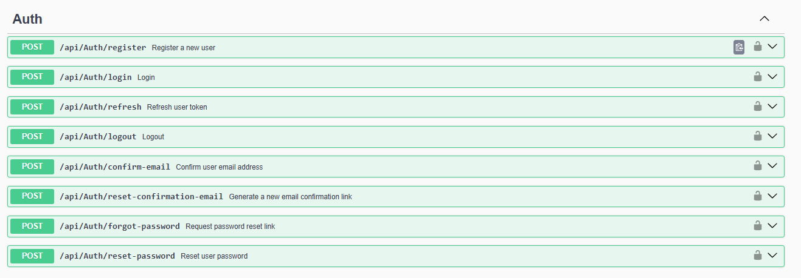
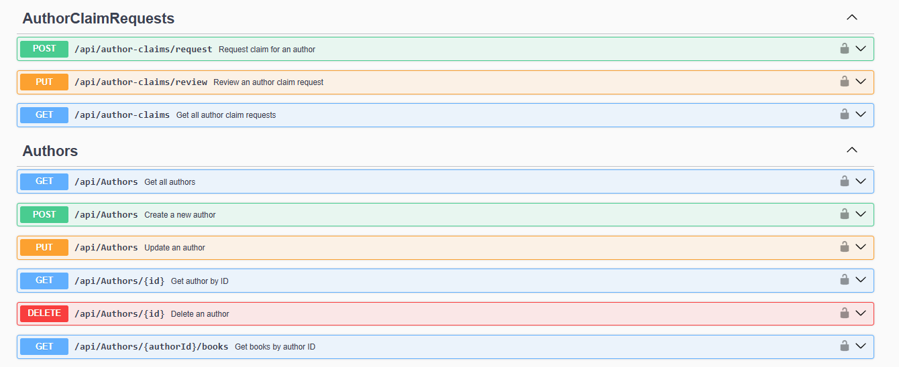
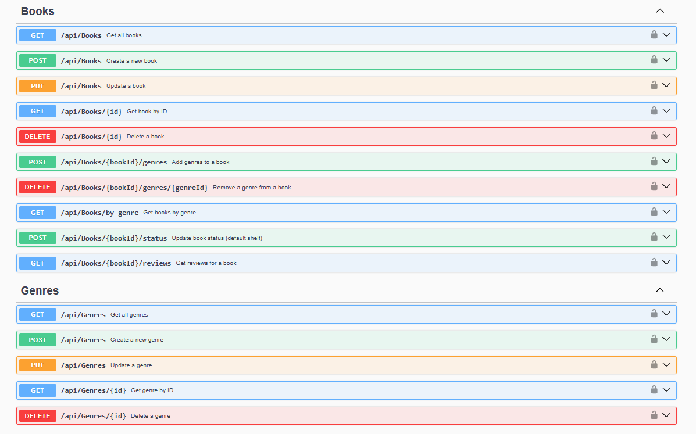
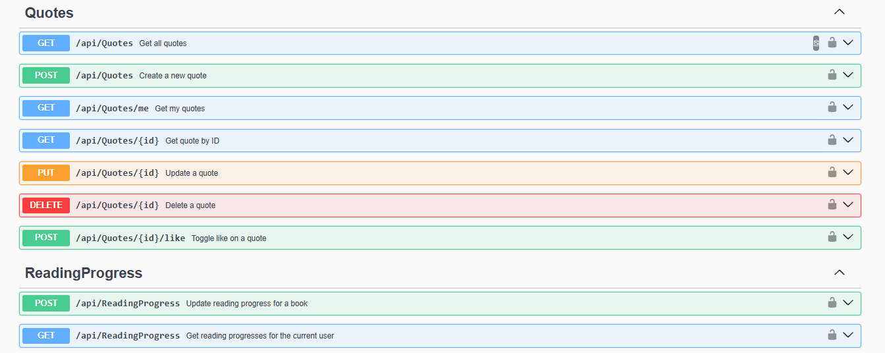
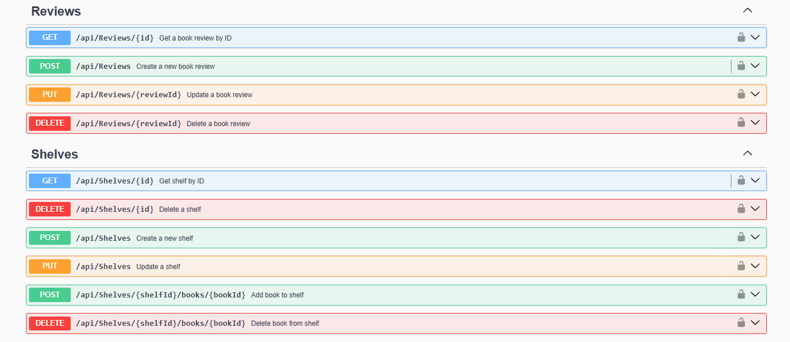
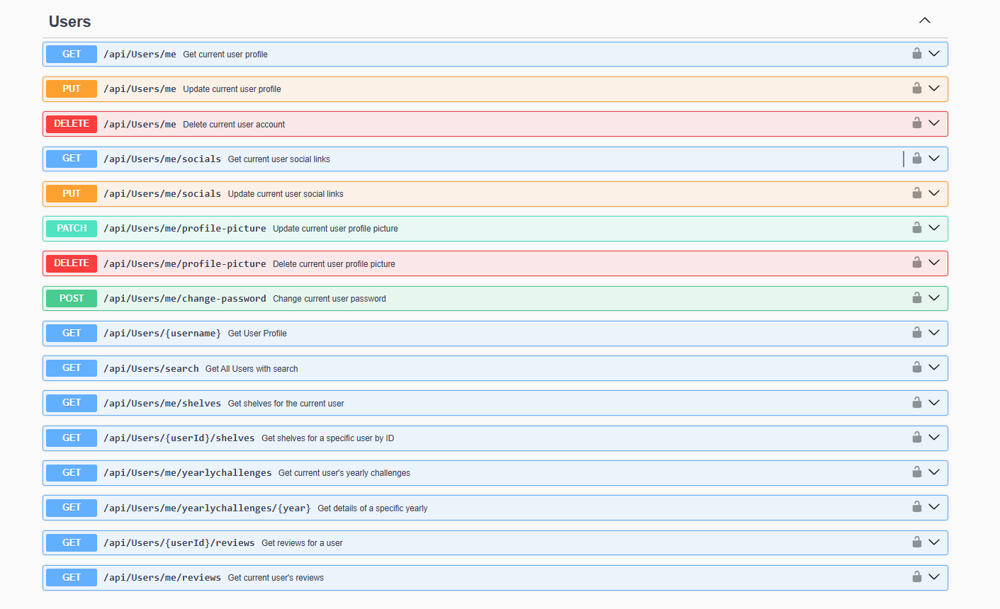
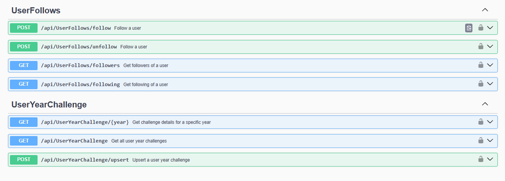

<div align="center">
  <h1>Goodreads Clone</h1>
  <p>A modern, modular, and extensible RESTful API inspired by Goodreads, built with ASP.NET Core (.NET 9), Entity Framework Core, MediatR, Follows Clean Architecture.</p>
      
      
      
      
      
      

  </div>

---

## Table of Contents

- [Features](#features)
- [Database Diagram](#database-diagram)
- [Endpoints](#endpoints)
- [Getting Started](#getting-started)
- [API Documentation](#api-documentation)
- [Background Jobs](#background-jobs)
- [Health Checks](#health-checks)
- [Contributing](#contributing)

---

## Features

- User authentication & JWT-based authorization
- Book, author, and review management
- Reading progress tracking
- Yearly reading challenges
- Email Support
- File uploads via Azure Blob Storage
- Background jobs with Hangfire
- Health checks and monitoring
- Swagger/Scalar documentation

---

## Database Diagram

## 

## Endpoints









---

## Getting Started

### Prerequisites

- [.NET 9 SDK](https://dotnet.microsoft.com/download/dotnet/9.0)
- [SQL Server](https://www.microsoft.com/en-us/sql-server/sql-server-downloads)
- (Optional) [SMTP4Dev](https://github.com/rnwood/smtp4dev) for local email testing
- (Optional) [Azurite](https://github.com/Azure/Azurite) for local Azure Blob Storage emulation

### Configuration

1. **Clone the repository:**

2. **Restore packages**

   ```bash
   dotnet restore
   ```

3. **Set up configuration:**

- Update `src/Goodreads.API/appsettings.Development.json` with your local connection strings and secrets as needed.

4. **Apply database migrations and seed data:**

- By default, `RunMigrations` is set to `true` in development. The database will be created and seeded automatically on first run.

- Run the migrations (manually).
  ```bash
  dotnet ef migrations add InitialCreate
  dotnet ef database update
  ```

5. **Run the application**
   ```bash
   dotnet run
   ```

## API Documentation

- Interactive API docs are available via Swagger at `/swagger` and Scalar at `/scalar`.

---

## Background Jobs

- Hangfire is used for recurring and background jobs.
- Dashboard available at `/hangfire`.

---

## Health Checks

- Health check endpoint: `/healthz`
- Includes checks for database and blob storage connectivity.

---

## Contributing

Contributions are welcome! Please open issues or submit pull requests for improvements.

[](https://www.linkedin.com/in/yahya-saad-a98801187)
